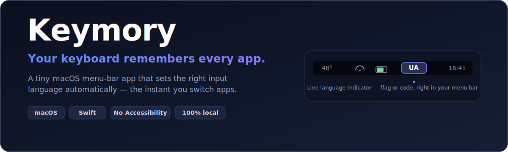
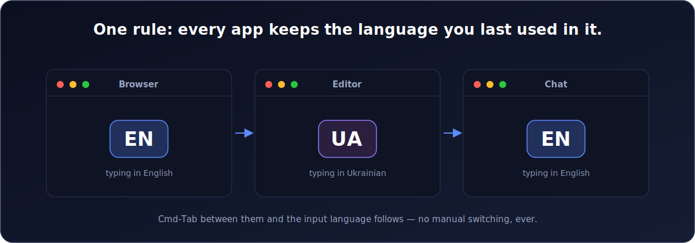
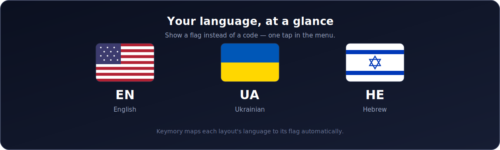
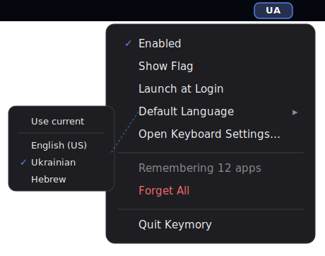

<p align="center">
  
</p>

<h1 align="center">Keymory</h1>

<p align="center">
  <b>The macOS menu-bar app that gives every application its own perfect keyboard language — automatically.</b>
</p>

<p align="center">
  
  
  
  
  
  
</p>

---

## 😩 The problem you've stopped noticing

You live in more than one language. Your browser is English. Your code editor is your mother tongue. Your terminal is English, your messenger is not. And macOS? macOS keeps **one** global input language and expects *you* to babysit it.

So you do the little dance a hundred times a day:

- Cmd-Tab to your editor → start typing → **wrong language** → delete → `⌃Space` → retype.
- Jump to the browser → search bar → **wrong language again** → delete → switch → retype.
- Multiply by every app switch, every day, forever. 🫠

It's death by a thousand keystrokes. macOS's built-in "switch per document" is unreliable and half-hidden, and every manual switch is a tiny tax on your focus.

## ✨ The fix: Keymory

**Keymory remembers the keyboard input language for every single app — and restores it the instant that app comes to the front.**

Set it once by just *using* your Mac the way you already do. From then on, the right language is simply *there*. No shortcuts to press. No thinking. No dance.

<p align="center">
  
</p>

> One rule, zero configuration: **when you activate an app, Keymory sets the language you last used in it.** First time it sees an app, it keeps whatever you're using and starts remembering from there. That's the whole mental model.

## 🚀 Why you'll love it

- 🧠 **Per-app memory that actually sticks.** English in Chrome, Ukrainian in your editor, whatever-you-want everywhere else. Keymory keeps them straight so you never fix a mis-typed first word again.
- ⏳ **Remembers forever.** Didn't open an app for a year? Keymory still nails its language the second you reopen it. Memory survives quits, reboots, and time.
- 🪄 **Zero setup.** No rules to define, no per-app lists to maintain. It learns silently as you work. Every app is remembered automatically.
- 🏳️ **A gorgeous live indicator.** See your current language right in the menu bar — as a **flag** (🇺🇸 🇺🇦 🇮🇱) or a crisp **code** (EN / UA / HE). One click to switch styles.
- 🌍 **Set a default language for new apps.** Want every brand-new app to start in English? Pick a default. Prefer it to adopt whatever's active? That's the default default.
- ⚡ **Invisible & featherweight.** A tiny menu-bar agent. No Dock icon, no window, no clutter, no lag.
- 🪟 **Follows pop-up windows (this build).** iTerm's hotkey terminal, Spotlight, Raycast, 1Password Quick Access — windows that appear without switching apps get their own remembered language too, switched **before you type**. Optional; asks for Accessibility. See below.
- 🔒 **Private & on-device.** Everything stays on your Mac — no network, no analytics, no account. The core needs no permissions; the optional **Track All Windows** mode uses Accessibility and even then reads only *which app* has focus, never your keystrokes.
- 🔁 **Launch at login.** Turn it on once and forget Keymory exists — which is exactly the point.
- 🛟 **Bulletproof.** Verifies each switch and retries if the system stalls. Remembered a layout you later removed? Keymory quietly leaves your current one alone instead of breaking.

<p align="center">
  
</p>

## 🖱️ Everything, one click away

<p align="center">
  
</p>

| Menu item | What it does |
| --- | --- |
| **Enabled** | Master switch for automatic switching. |
| **Track All Windows** | Follow keyboard focus into pop-up windows that never activate their app (iTerm hotkey terminal, Spotlight, Raycast, …) and switch the language before you type. Optional; asks for Accessibility. |
| **Show Flag** | Toggle the menu-bar indicator between a flag and a language code. |
| **Launch at Login** | Start Keymory automatically when you log in. |
| **Default Language ▸** | Language for apps Keymory hasn't seen yet (or "Use current input source"). |
| **Open Keyboard Settings…** | Jump straight to macOS Keyboard ▸ Input Sources. |
| **Remembering N apps** | How many apps Keymory currently knows. |
| **Forget All** | Wipe the memory and start fresh. |
| **Quit Keymory** | Quit the app. |

## 🪟 Track All Windows: pop-ups that never switch apps (this build)

Some windows take your keyboard without ever *activating* their app: iTerm2's hotkey
drop-down terminal, Spotlight, Raycast, 1Password's Quick Access. macOS fires no
app-activation event for them, so an ordinary per-app switcher can't see them.

This build can. Turn on **Track All Windows** and Keymory watches where the keyboard focus
actually is and switches the language **before you type the first letter** — no extra
click, no lost first character. It works for **any** app's pop-up window, present or
future; there's no list to maintain.

This is the one feature that needs a permission — **Accessibility** (System Settings ▸
Privacy & Security ▸ Accessibility). The honest fine print:

- Keymory reads only **which application currently has keyboard focus** — never your
  keystrokes and never window contents.
- It uses that solely to pick which app's remembered language to restore.
- Turn the option off and Keymory stops watching entirely.
- Because it needs Accessibility, this build is **not sandboxed** and ships as a direct
  download, not on the Mac App Store. (The App Store build stays sandboxed and simply
  doesn't include this feature.)
- It's open source — the only file involved is
  [`Keymory/AXActivationDetector.swift`](Keymory/AXActivationDetector.swift).

## 📦 Install

Keymory is currently built from source (a signed release is on the roadmap).

```bash
git clone git@github.com:mekh/keymory.git
cd keymory

# Build a Release app
xcodebuild -project Keymory.xcodeproj -scheme Keymory \
  -configuration Release -derivedDataPath build.noindex build

# Install it
cp -R build.noindex/Build/Products/Release/Keymory.app /Applications/
open /Applications/Keymory.app
```

Or just open `Keymory.xcodeproj` in Xcode and press **Run**.

On first launch, look for the language indicator in your menu bar and enable **Launch at Login**. That's it — go back to work and let Keymory disappear into the background. To follow pop-up windows too, open the menu and turn on **Track All Windows**, then grant Accessibility when prompted.

> **This is the non-sandboxed build.** It exists specifically to switch the language for pop-up windows before you type, which needs the Accessibility API — something the App Sandbox forbids. If you don't need that, the sandboxed App Store build is the safer, lighter choice.

> **A note on menu bars with a notch:** if your menu bar is crowded, macOS may tuck new items behind the camera notch. Hold **⌘** and drag Keymory's indicator to a spot you can see — it'll stay put.

## 🧠 Why "Keymory"?

**Key** + **memory.** A keyboard with a memory for every app. It also happens to remember so you don't have to.

## 🔍 How it works (for the curious)

Keymory listens for app-activation events and, when you switch apps, restores that app's remembered input source via Apple's Text Input Source (TIS) API. While an app is frontmost, it quietly notes any language change you make and files it under that app. Everything is a tiny `bundle id → input source` map persisted locally — a few bytes per app, kept forever.

- Reads/writes input sources with `TISCopyCurrentKeyboardInputSource` / `TISSelectInputSource`.
- Tracks the frontmost app via `NSWorkspace` activation notifications.
- Persists to `UserDefaults`; no files, no database, no cloud.
- The core needs no permissions. The optional **Track All Windows** mode uses the Accessibility API to see which app holds keyboard focus — including non-activating pop-ups — and switch before you type.
- This build runs **outside** the App Sandbox, which is required for the Accessibility API to observe other apps. The App Store build is sandboxed and omits Track All Windows.

## 🤏 Good to know

Keymory is honest about the edges:

- A few apps that manage their own text input (some Electron/terminal/Java apps) may occasionally ignore a system-level switch. Rare, and on the roadmap.
- Non-activating pop-ups (iTerm hotkey terminal, Spotlight, Raycast, …) are handled by **Track All Windows** — the language switches before you type. With that option off, a change made in such a window is attributed to the previous app and self-corrects next time you type.
- Complex IME languages (Chinese/Japanese/Korean) are not the focus of this version — Latin/Cyrillic layouts are first-class today.

## 🤝 Contributing

Keymory focuses on Latin and Cyrillic layouts today. **If your language or input method isn't supported well — CJK/IME (Chinese, Japanese, Korean), or anything else — your PR is highly welcome!** The switch logic has a verify/retry seam in `SwitchController.restore(...)` that's the natural place to plug in IME-specific handling.

## 🗺️ Roadmap

- Signed & notarized release + Homebrew cask

## 📄 License

Released under the [MIT License](LICENSE). © 2026 Oleksandr Miekh.

---

<p align="center"><b>Stop babysitting your keyboard. Let Keymory remember.</b></p>
